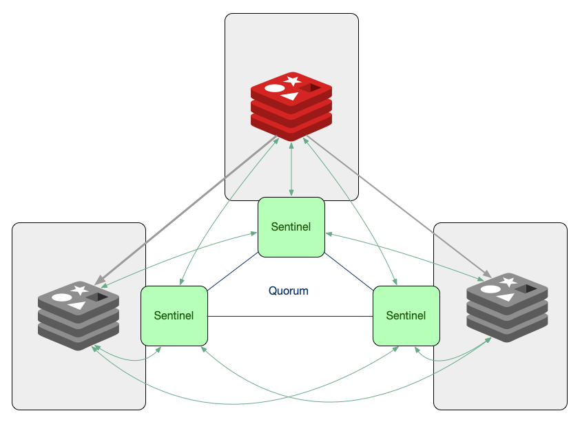
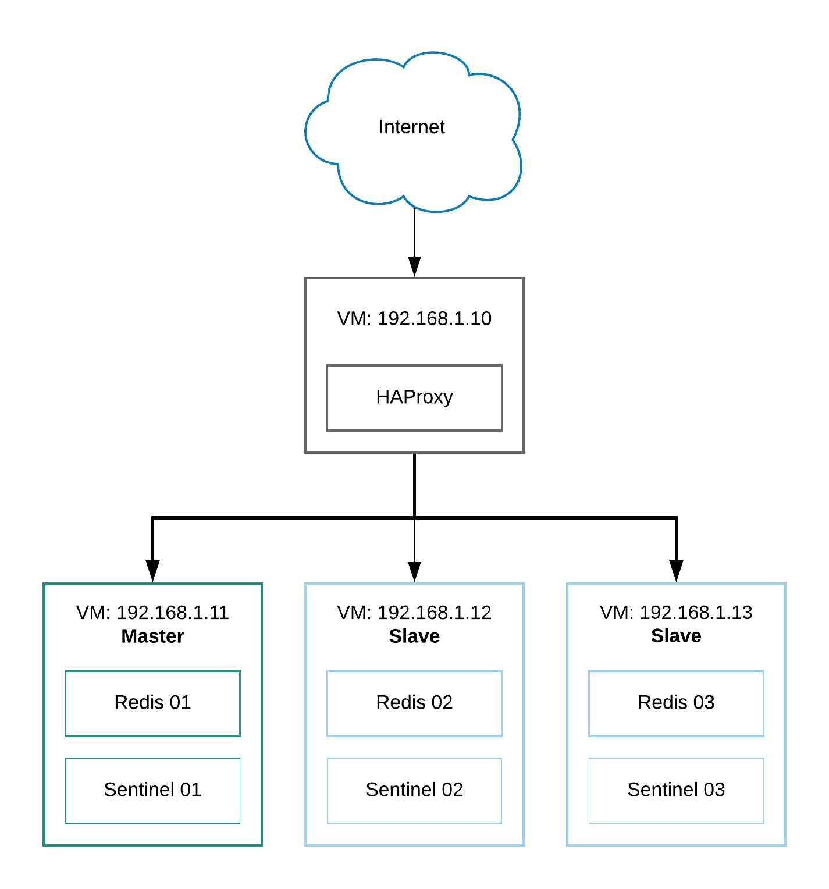
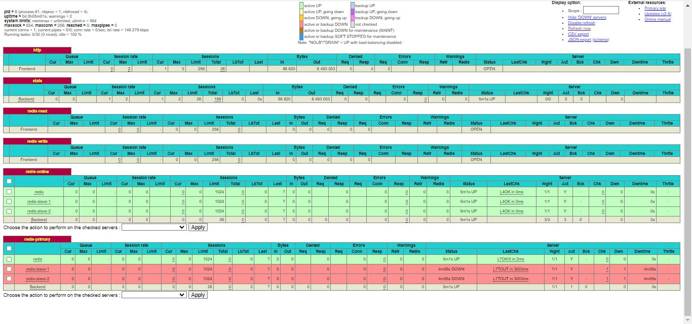

# Redis + Sentinel + Haproxy

The word Redis stands for Remote Dictionary Server. To put it simply, a Redis database is a data structure that stores information in RAM. This makes the speed of accessing information much higher. High speed is the biggest advantage and the main difference between redis database and other databases. Due to the fact that the information in Redis is kept inside RAM, it is called In-Memory Database.


From the data storage location in Redis, it is clear that this database is a temporary storage location. This database is suitable for information that is very frequently used and needs to be constantly called from the server. In this case, information is temporarily stored on RAM and quickly transferred to the user. This method achieves better user satisfaction and the site manager will need less resources for service.

# Redis Sentinel




It is a system designed to help manage Redis instances. It performs the following four tasks:

1- Monitoring: Sentinel constantly checks whether your master and slave instances are working as expected.

2- Notification: Sentinel can notify the system administrator or other computer program through an API that there is a problem in one of the monitored Redis instances.

3- Automatic failover: If a master is not working as expected, Sentinel can initiate a failover process in which a slave is promoted to master, other additional slaves are reconfigured to use the new master, and applications Applications are notified using the Redis server about the new address to use when using it.

4- Configuration provider: Sentinel acts as a power source for client service discovery: clients connect to Sentinels to ask for the address of the current Redis Master responsible for a given service. If a failure occurs, Sentinels reports the new address.

# HAProxy


HE Proxy, which stands for High Availability Proxy, is a popular open source TCP/HTTP Load Balancer and proxy solution that can run on Linux, macOS, and FreeBSD. Its most common use is to improve the performance and reliability of a server environment by distributing the workload across multiple servers (eg web, application, database). It is used in many popular environments including: GitHub, Imgur, Instagram and Twitter.

# Using the Docker Compose file




The following file composition includes 3 Redis services, 1 Master service and 2 Slave services.

There are 3 Sentinel services and 1 HAProxy service

```bash 

version: '2'

networks:
  web_net:
    external: true
  app_net:
    external: false

services:
  redis:
    image: 'bitnami/redis:latest'
    environment:
      - REDIS_REPLICATION_MODE=master 
      - REDIS_PASSWORD=str0ng_passw0rd 
    networks:
      - app_net

  redis-slave-1:
    image: 'bitnami/redis:latest'
    environment:
      - REDIS_REPLICATION_MODE=slave 
      - REDIS_MASTER_HOST=redis 
      - REDIS_MASTER_PASSWORD=str0ng_passw0rd 
      - REDIS_PASSWORD=str0ng_passw0rd
    depends_on:
      - redis
    networks:
      - app_net

  redis-slave-2:
    image: 'bitnami/redis:latest'
    environment:
      - REDIS_REPLICATION_MODE=slave 
      - REDIS_MASTER_HOST=redis 
      - REDIS_MASTER_PASSWORD=str0ng_passw0rd 
      - REDIS_PASSWORD=str0ng_passw0rd
    depends_on:
      - redis
      - redis-slave-1
    networks:
      - app_net

  redis-sentinel-1:
    image: 'bitnami/redis-sentinel:latest'
    environment:
      - REDIS_MASTER_PASSWORD=str0ng_passw0rd 
    depends_on:
      - redis
      - redis-slave-1
      - redis-slave-2
    networks:
      - app_net
  
  redis-sentinel-2:
    image: 'bitnami/redis-sentinel:latest'
    environment:
      - REDIS_MASTER_PASSWORD=str0ng_passw0rd 
    depends_on:
      - redis
      - redis-slave-1
      - redis-slave-2
    networks:
      - app_net
      
  redis-sentinel-3:
    image: 'bitnami/redis-sentinel:latest'
    environment:
      - REDIS_MASTER_PASSWORD=str0ng_passw0rd
    depends_on:
      - redis
      - redis-slave-1
      - redis-slave-2
    networks:
      - app_net
      
      
  haproxy:
    image: haproxy:latest
    container_name: haproxy
    restart: always
    ports:
      - '3000:3000'
      #- '${REDIS_PRIV_IP}:6379:6379'
    depends_on:
      - redis
      - redis-slave-1
      - redis-slave-2
      - redis-sentinel-1
      - redis-sentinel-2
      - redis-sentinel-3
    networks:
      - web_net
      - app_net
    volumes:
      - ./haproxy.cfg:/usr/local/etc/haproxy/haproxy.cfg

```
## haproxy.cfg

```bash 

global
	daemon
	maxconn 256

defaults
	mode tcp
	timeout connect 5000ms
	timeout client 50000ms
	timeout server 50000ms

frontend http
	bind :3000
	default_backend stats

backend stats
	mode http
	stats enable
	stats enable
	stats uri /
	stats refresh 1s
	stats show-legends
	stats admin if TRUE

frontend redis-read
    bind *:6380
    default_backend redis-online

frontend redis-write
	bind *:6379
	default_backend redis-primary

backend redis-online
	balance roundrobin
	server redis redis:6379  maxconn 1024 check inter 3s
	server redis-slave-1 redis-slave-1:6379 maxconn 1024 check inter 3s
	server redis-slave-2 redis-slave-2:6379 maxconn 1024 check inter 3s

backend redis-primary
    mode tcp 
    option tcp-check 
    tcp-check send AUTH\ str0ng_passw0rd\r\n 
    tcp-check expect string +OK 
    tcp-check send PING\r\n 
    tcp-check expect string +PONG 
    tcp-check send info\ replication\r\n 
    tcp-check expect string role:master 
    tcp-check send QUIT\r\n 
    tcp-check expect string +OK 
	server redis redis:6379  maxconn 1024 check inter 3s
	server redis-slave-1 redis-slave-1:6379 maxconn 1024 check inter 3s
	server redis-slave-2 redis-slave-2:6379 maxconn 1024 check inter 3s

```

1- compose pull images  
2- docker network create web_net  
3- docker compose up -d


